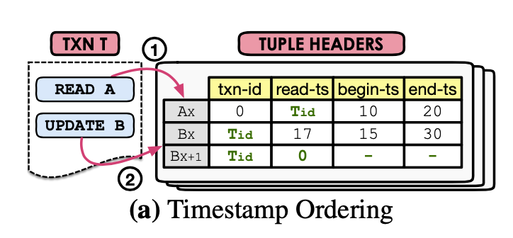
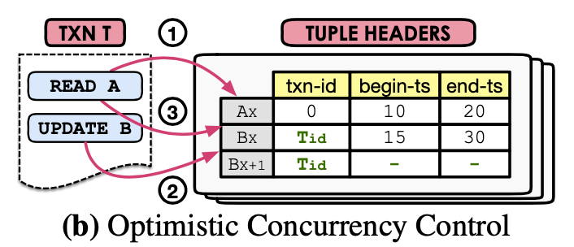
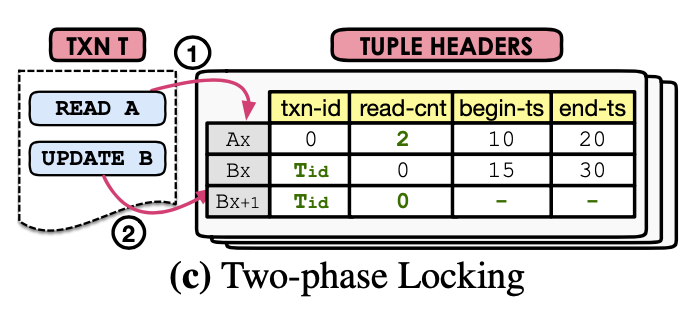
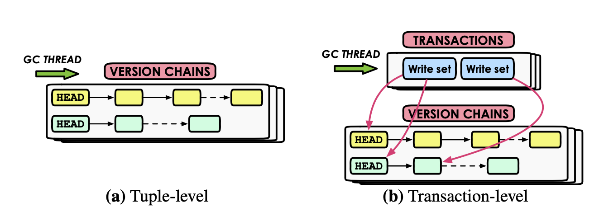

## 前言
印象中第一次看见 `MVCC` 是在[《DDIA》](https://www.amazon.com/Designing-Data-Intensive-Applications-Reliable-Maintainable/dp/1449373321)这本书上，书中 `MVCC` 是作为解决 [Non-repeatable Read](https://en.wikipedia.org/wiki/Isolation_(database_systems)#Non-repeatable_reads) 问题的解决方法提出的，当时觉得非常**nb**，但是现在细想来其实对其中的实现细节并不清晰，如果让我来实现一个 `MVCC` 无从下手。而且既然 `MVCC` 可以解决 `Non-repeatable Read` 问题，那它能不能解决其他隔离性的问题？如何做到？最近阅读到了[《An Empirical Evaluation of In-Memory Multi-Version Concurrency Control》](https://15721.courses.cs.cmu.edu/spring2020/papers/03-mvcc1/wu-vldb2017.pdf)这篇论文对 `MVCC` 的实现有了更深入的了解，这篇文章就是我结合论文和自己的一些理解来尝试剖析一下 `MVCC`。
## MVCC 简介
`Multi-Version concurrency control(MVCC)` 从名字上看就是一种并发控制算法用以**控制并发读写单一对象时的行为，尽可能减少竞争并保证一定隔离性**。实现的基本原理是同时维护同一个逻辑对象（`Logical Object`） 不同时间段的逻辑对象，而一个逻辑对象在某个时间段的数据被称为一个 `Version` ，当对一个对象进行读/写操作时会根据相应的规则返回特定的 `Version` ，如果对某个对象完成了更新操作并不会直接将更新应用在其访问的 `Version` 对象上，而且重新创建一个新 `Version` 对象。

## MVCC 实现
在论文中将 `MVCC` 的关键组件分为四个：`Protocol`、`Version Storage`、`GC（Garbage Collection）`和 `Index`，而 MVCC 所管理的逻辑对象可以是一个事务（`Transactions`）或者数据表的一行数据（`Tuple/Record`），一般都是以 `tuple` 为操作对象，下面都以 `tuple` 来介绍。`tuple` 的存储格式如下（不同 `protocol` 会有所区别）

### 1. Protocol
#### MVTO（Timestamp Ordering）
`MVTO` 为每个事务分配一个唯一的时间戳($T_{id}$)，它会中止所有试图读/更新已经被设置 `write lock` 的 `version tuple`（当 `txn-id` 不等于 0 或者自己的 $T_{id}$ 时表示有其他事务持有 `write lock`）的事务。`MVTO` 协议的 `tuple header` 如下：

1. 对 `tuple A` 进行读操作：
   a. 搜索 `A` 的所有 `version` 中满足 begin-ts <= $T_{id}$ <= end-ts 
   b. 并且没有其他事务持有该 `version` 的 `write lock`，则可以读该 version 
   c. 如果 read-ts < $T_{id}$ 的话，更新 read-ts = $T_{id}$
2. 对 `tuple B` 进行更新：
   a. 找到 `B` 的最新 `version`（$B_x$），并满足 b、c 条件
   b. 没有其他事务持有 `write lock`
   c. $T_{id}$ >= read_ts
   d. 如果满足 b、c 条件则创建一个新版本的 tuple $B_{x+1}$，并加写锁 $B_x$，令其 txn-id = $T_{id}$，当事务 `commit` 时，更新 $B_{x+1}$ 的 begin-ts = $T_{id}$，end-ts = `INF`

思考：读/更新操作冲突的情况？

#### MVOCC（Optimistic Concurrency Control）
`MVOCC` 将事务分为三个阶段：`read phase`、`validation phase`、`write phase`

1. read phase：可以进行对 `tuple` 的读和更新操作
    a. 读只需要找到满足 begin-ts <= $T_{id}$ <= end-ts 的 `version` 就可以读
    b. 更新则需要 `tuple` 最新的 `version` 没有被加写锁并且同样会和 `MVTO` 一样创建新的 $B_{x+1}$ 的新 `version`，并且设置 $B_x.txn-id = T_{id}$（这里新创建的 $B_{x+1}$ 对其他事务**不可见**）
2. validation phase：事务 `commit` 时，为事务重新分配一个时间戳 $T_{commit}$，验证该事务的所有读操作的 `tuple` 集合是否存在并发的事务在对同一个 `tuple` 进行更新操作，如果没有则通过验证，否则中止事务
3. write phase：将新创建的 `versions` 正式写入到存储中，并更新其 begin_ts = $T_{commit}$ end_ts = `INF`

思考：
1. 读/更新操作冲突的情况？
2. `MVOCC` 和 `MVTO` 的区别？

#### MV2PL（Two-phase Locking）
`MV2PL` 每个事务会**预先申请**好其所需要读/写相关 `tuple` 的 `lock`，`write lock` 是 `txn-id`，`read-lock` 是 `read-cnt`，当事务中止或者提交时再释放所持有的锁 

1. 读 `tuple A` 获取 `read lock`：
    a. 搜索 `A` 的所有 `version` 中满足 begin-ts <= $T_{id}$ <= end-ts
    b. 没有其他事务持有该 `version` 的 `write lock`，则 `read-cnt + 1`
2. 更新 `tuple B` 获取 `write lock`：
    a. 找到 `B` 最新的 `version`（$B_x$），满足以下两个条件则获得 $B_x$ 的 `write lock`
    b. 没有其他事务持有 `write lock`
    c. `read-cnt = 0`
3. 更新 `tuple B` 会和之前的协议一样创建新的 `version`($B_{x+1}$)
4. 事务提交时：`DBMS` 会分配一个 $T_{commit}$ 去更新被事务新创建的 `version.begin-ts` 并且释放所有其持有的 lock（read-cnt - 1, txn-id = 0）

思考：
1. 读/更新操作冲突的情况？
2. 和之前两个协议的区别？
3. 上面这个 `MV2PL` 有什么问题？

#### SSI（Serialization Snapshot Isolation）
`SSI` 是在其他 `MVCC` (除开 `MV2PL`) 方法的基础上实现串行化的方法，它的理论基础是为每个之间事务定义 `dependency` 关系（设存在两个并行事务 `T1`、`T2`）: 
    1. ww-dependency: 两个事务先后对同一个对象 `X` 进行写入操作
    2. wr-dependency：`T1` 写入 `X` 后（提交之前） `T2` 读取 `X`
    3. rw-dependency(也叫 anti-dependency)：`T1` 读取了 `X`，`T2` 写入了一个更新的 `X`
   
如果当前正在运行的事务集合中存在连续的两个 `anti-dependecy` 并且 `dependecy` 成环就可能出现异常现象，`SSI` 就是追踪 `anti-dependency` 如果发现连续的就中止其中一个事务（会重试事务），具体细节可参考论文 [《Serializable Snapshot Isolation in PostgreSQL》](https://15721.courses.cs.cmu.edu/spring2020/papers/03-mvcc1/p1850_danrkports_vldb2012.pdf "Serializable Snapshot Isolation in PostgreSQL")

**write-skew(写倾斜)**
在 MVCC 中不能保证串行化的协议天然会存在 write-skew 的情况，例如：当前两个医生值班，每天需要满足至少一个医生在岗值班其他医生才能请假，这时并发两个事务分别对两个医生进行请假，他们都先读取到了一个 `version` （有两个人值班），满足条件，然后都请假成功，最终不满足值班条件。

思考：
1. `SSI` 和 `MV2PL` 的区别？
### 2. Version Storage
`Version Storage` 是解决如何存储同一个 `tuple` 的多个 `version`，不同的方法之间对于读写性能的影响也不同，这里主要介绍四种方法。

1. **Append-only Storage**: 每个 `table` 中的所有 `tuple version` 都存储在同一空间中，同一个 `tuple` 的不同 `version` 构成单向链表（方便实现 `lock-free`），根据链表 `HEAD` 指向的 `version` 不同可以分为：`O2N`（Oldest-to-Newest） 和 `N2O` （Newest-to-Oldest）
	   a. `O2N`：`HEAD` 指向最旧的 `version`，优点：新增 `version` 时不需要更新 `index`，缺点：查询最新 `version` 需要遍历链表
	   b. `N2O`：`HEAD` 指向最新的 `version`，优点：查询最新 `version` 很快，缺点：新增 `version` 时需要更新 `index`
    `Append-only` 的缺点：`version` 冗余复制了尚未修改的数据项
3. **Time-Travel Storage**：这种方法将老旧的 `version` 另外放在一个 `time-travel table` 中存储，只有最新的 `version` 存储在 `main` `table` 中，每次创建新的 `version` 就在 `time-travel table` 中创建一个新的 `version` 将 `main table` 中的 `version` 复制，然后将修改直接应用在 `main table` 的 `version` 上（`time-travel table` 中的 `version` 也是链表形式存储）
     优点：不需要更新 `index`，查询最新的 `version` 很快
     缺点：和 `Append-only` 一样存在冗余复制
4. **Delta Storage**：和 `Time-Travel` 类似最新的 `version` 存储在 `main table` 中，其他 `version`（被称为 `Delta version`）存储在 `delta table` 中，但是仅存储被修改的数据项
	  优点：对于更新操作频繁的更节省空间
	  缺点：对于读操作需要遍历 `delta table` 链表来获取完整的 `tuple`（非最新）
### 3. GC
`MVCC` 会无限制的创建 `version` 最终导致超出存储空间，因此需要 `GC` 来及时回收哪些无用的 `version` 所占用的存储空间。
> 无用的 version：1. 属于被中止的事务；2. end-ts 小于所有正在运行事务的 $T_{id}$。

`GC` 运行可以分为三步：1. 检测出无用 `version`；2. 将 `version` 从其所属的 `version` 链表中移除并更新索引；3. 回收 `version` 存储空间

主要的设计难点在于如何快速有效的检测出无用 `version` 减少 `GC` 运行时间

**Epoch-Based memory management**：是一种粗力度的追踪 `version` 的方法，原理是构建很多 `epoch`，其中最新的 `epoch` 被称为 `active epoch`，其他的 `epoch` 按照 `FIFO` 的方式构成队列。每个 `epoch` 维护一个计数器，当一个新的事务运行时，`active epoch` 计数器 +1，当事务运行结束时（commit or abort）其关联的 `epoch` 计数器 -1。当一个非 `active` 的 `epoch` 计数器 = 0 时，并且其之前的所有 `epoch` 没有绑定正在运行的事务，那么这时可以安全回收在这个 `epoch` 更新过的无用 `version` 。

一般存在两种 `GC` 的实现方法：这两种方法主要区别在于如何发现无用 `version`
1. **Tuple-level GC**：对每个 `tuple` 检查 `version` 是否过期。具体有两种方案：1. 定期扫所有 `tuple`；2. 在事务运行查找 `version` 链表时检查（仅适用于 `O2N` 结构）
2. **Transaction-level GC**：检查对象是一个事务中的创建的 `version`，当所有在事务 `T` 中被创建的 `versions` 对所有正在运行的事务不可见时那么称这个事务 `T` 过期了，其中的 `version` 被标记为无用

### 4. Index
索引分为主索引和二级索引，索引有 `key`、`value`，`value` 一般为指针
**主索引**：`key` 为主键、`value` 为 `tuple`，索引更新根据不同的 `version storage` 不同，并且 `value` 不会改变
**二级索引**：`key` 为任意 `table` 列项，`value` 也可以改变包含多个不同的 `tuple`

这里主要针对二级索引有不同的方法：
1. **Logical Pointer**：`value` 指向一个中间层，中间层提供为每个 `tuple` 设置一个 `identifier` 到 `tuple` 的 `version` 链表 `HEAD` 的映射关系，二级索引的 `value` 指向这个 `identifier`
2. **Physical Pointer**：`value` 指向实际 `version tuple` 的地址

### 总结
论文上提供的一些流行 `DBMS` 的 `MVCC` 的实现

## MVCC 与隔离性(isolation)
### 隔离性
> 1. In database systems, isolation determines how transaction integrity is visible to other users and systems.
> 2. Isolation is typically defined at database level as a property that defines how or when the changes made by one operation become visible to others.     

这两句话是维基百科上对于 `isolation`（隔离性）的一个定义：
1. 隔离性决定一个事务对于其他用户/系统的可见性
2. 隔离性定义了某个操作造成的数据变化在什么时间、以怎样的方式可以被其他人所见

当隔离性越弱，其他用户/系统能够在同一时间访问同一个数据的可能性就越大，这里就会造成并发冲突，导致结构不正确。但是隔离性越强就代表并发越低，即事务会被阻塞运行，性能会越差。并发控制算法(如：`MVCC`)就是为了来解决这里造成的并发冲突并且实现较高的性能。
### 事务异常现象
1. **Dirty reads**
一个事务能够看到其他未提交事务已经更新过的数据。
2. **Non-repeatable reads**
一个事务 `T1` 重复取相同的*一行数据*两次，而这行数据在这两次读取期间被其他事务 `T2` 更新,并且 `T2` 在 `T1` 第二次读取之前已经提交，这时 `T1` 前后拿到的数据不一致 并且 `T2` 在 `T1` 第二次读取之前已经提交，这时 `T1` 前后拿到的同一行的数据不一致。
3. **Phantom reads**
一个事务 `T1` 重复取相同的*一个集合的数据*两次，而这期间其他事务 `T2` 插入新数据到这个集合中或删除这个集合的某个数据，并且 `T2` 在 `T1` 第二次读取之前已经提交，这时 `T1` 前后拿到的数据集合不一致。
4. **Write skew**
见前文

### 隔离级别(ANSI/IOS SQL 定义)
1. **Serializable**
串行化有两种实现方案：
   1. 基于锁: 基于锁的方案会让读/写请求串行获取读锁/写锁，并在事务中止时释放锁，同时需要范围锁  来防止 `phantom reads`
   2. 不基于锁: 需要保证当多个并发事务出现 `write collision` 时，只让其中一个事务提交
2. **Repeatable reads**
和串行化基于锁的方案一样依旧需要读锁/写锁，但是不需要范围锁(即会出现 `phantom reads`)，同时会出现 `write skew`
3. **Read committed**
只有写操作才会一直持有写锁直到事务结束，而读锁在读操作结束就已经释放。只不会出现脏读
4. **Read uncommitted**
所有异常现象都会出现

思考：MVCC 属于哪一种？
### MVCC 与隔离级别
`MVCC` 与隔离级别并没有强绑定关系，`PostgreSQL` 使用 `MVCC` [实现了四种隔离级别](https://www.postgresql.org/docs/current/transaction-iso.html)，而且它的隔离级别实现和 ANSI/IOS SQL 定义不一样
## 参考资料
1. [《An Empirical Evaluation of In-Memory Multi-Version Concurrency Control》](https://15721.courses.cs.cmu.edu/spring2020/papers/03-mvcc1/wu-vldb2017.pdf)
2. [Wikipedia Isolation](https://en.wikipedia.org/wiki/Isolation_(database_systems))
3. [why-write-skew-can-happen-in-repeatable-reads](https://stackoverflow.com/questions/48417632/why-write-skew-can-happen-in-repeatable-reads)
4. [Postgresql Transaction Isolation](https://www.postgresql.org/docs/current/transaction-iso.html)